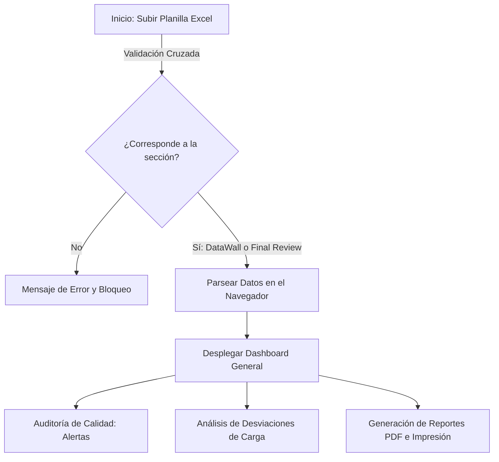

# Informe Técnico del Proyecto: Dashboard de Carguío de Tronaduras (Enaex - Sierra Gorda)

Este documento resume los aspectos arquitectónicos, tecnológicos, matemáticos y operacionales de la aplicación web del **Dashboard de Carguío** desarrollada para Enaex en Minera Sierra Gorda. Su objetivo es servir como manual y guía explicativa para que cualquier persona pueda comprender el funcionamiento de la herramienta.

---

## 1. Resumen General del Proyecto
La aplicación es una herramienta interactiva Single Page Application (SPA) para ingenieros y operadores que automatiza la auditoría, control de calidad y validación de las planillas de carguío de pozos de tronadura.

### Flujo de Trabajo Principal

### Tecnologías Utilizadas
La aplicación está desarrollada con tecnologías modernas de desarrollo frontend que garantizan velocidad, independencia de servidores y un diseño responsivo premium:
1. **Core**: HTML5, CSS3 (Vanilla con diseño responsivo, glassmorphic y soporte de temas claro/oscuro) y JavaScript (ES6+).
2. **Framework**: **React 18** (con **Vite** para compilación ultrarrápida del código del cliente).
3. **Procesamiento de Archivos**: **SheetJS (librería `xlsx`)** para leer y procesar las planillas de Excel nativamente en el navegador sin subir los archivos a ningún servidor, garantizando seguridad y confidencialidad.
4. **Visualización Gráfica**: **Recharts** para representar la comparación de cargas reales vs. teóricas de manera interactiva.
5. **Iconografía**: **Lucide React** para la visualización de íconos vectoriales SVG limpios.
6. **Despliegue/Hosting**: **Vercel** conectado a GitHub para integración y despliegue continuo (CI/CD).

---

## 2. Resumen de Cálculos y Fórmulas Matemáticas

La aplicación automatiza diversos cálculos físicos e ingenieriles a partir de los datos ingresados en el Excel:

### A. Carga Teórica de Explosivo (kg)
Representa la cantidad de masa de producto (explosivo) que debería entrar físicamente en el pozo en base a sus dimensiones geométricas y la densidad del producto. Se asume que el pozo es un cilindro perfecto.

*   **Fórmulas Utilizadas**:
    1.  **Altura de Carga ($H$)**: Es la longitud del pozo ocupada por explosivos. Se calcula restando el taco de la longitud real:
        $$H = \text{Longitud Real (m)} - \text{Taco (m)}$$
    2.  **Conversión de Diámetro ($D_{in}$)**: El diámetro del pozo ingresado en pulgadas (incluso si está escrito como fracción, ejemplo: `"6 1/2"`) se convierte a un número decimal (`6.5`). 
        *   **Tratamiento de Errores y Limpieza**: Para robustecer el cálculo, se eliminan todos los caracteres que no sean dígitos, comas `,`, puntos `.`, barras `/` o comillas `"`.
        *   **Conversión mm a Pulgadas**: Si el diámetro se ingresó en milímetros (valor numérico resultante > 20), el sistema lo convierte automáticamente a pulgadas dividiendo por `25.4` antes de calcular el volumen.
    3.  **Densidad del Producto ($\rho$)**: Se realiza una búsqueda interna de la densidad del producto según su tipo in situ:
        *   *Quantex 70 / Q70 / UP70 / San G*: `1.20 g/cc`
        *   *Quantex 80 / Q80 / UP80*: `1.25 g/cc`
        *   *Default*: `1.20 g/cc`
    4.  **Cálculo Teórico**: El peso teórico en kilogramos se obtiene con la constante del cilindro en pulgadas:
        $$\text{Carga Teórica (kg)} = H \times 0.50671 \times D_{in}^2 \times \rho$$

### B. Desviación de Carga (kg y %)
Contrasta la carga de explosivo realmente aplicada en el terreno contra el valor teórico calculado geométricamente.
*   **Desviación en Kilogramos**:
    $$\text{Desviación (kg)} = \text{Carga Real Total (kg)} - \text{Carga Teórica (kg)}$$
*   **Desviación Porcentual**:
    $$\text{Desviación (\%)} = \left( \frac{\text{Desviación (kg)}}{\text{Carga Teórica (kg)}} \right) \times 100$$
*   **Criterio de Tolerancia**: Si la desviación porcentual supera los rangos establecidos para el producto (ej: $\pm 10\%$), el pozo se clasifica como *Fuera de Tolerancia* y se destaca en la tabla.

### C. Subida Lineal del Explosivo (kg/m)
Representa cuántos kilogramos de explosivo se cargan por cada metro de longitud del pozo.
*   **Fórmula**:
    $$\text{Subida Lineal} = 0.50671 \times D_{in}^2 \times \rho$$
*   **Uso**: Desplegado como tooltip instantáneo (0ms) en la columna de diámetro en el panel de desviaciones (ej: *"Subida lineal 28.5 kg x mt"*).

---

## 3. Detección y Señalización de Errores (Control de Calidad)

La aplicación audita cada fila de la planilla importada en tiempo real buscando 3 grupos de inconsistencias:

| Alerta de Calidad | Criterio de Búsqueda | Consecuencia / Trazabilidad |
| :--- | :--- | :--- |
| **Cargas con Decimales, Vacías o Descuadres** | Se gatilla si la suma de `Carga Fondo + Carga Columna` tiene decimales o está vacía, o si la columna `Carga Total` está vacía o tiene decimales, o si la suma de cargas no coincide con `Carga Total` (descuadre > 0.1 kg). | Indica error de tipeo manual del operador o falta de cuadratura de pesos. |
| **Trazabilidad Mandatoria (Vacíos)** | Falta `Carga Total`, `Carga Fondo` y `Carga Columna` a la vez (pozo vacío). O falta el Tipo de Explosivo / Camión para fondo y columna a la vez. O falta Operador. **Validación Cruzada Activa**: Si `Carga Fondo > 0` exige Tipo y Camión de Fondo. Si `Carga Columna > 0` exige Tipo y Camión de Columna. | Omisión de información clave para la trazabilidad y procedencia del carguío del pozo. |
| **Diámetro en mm o ERR** | El texto en el diámetro contiene las siglas `mm`, `err`, o números superiores a 20 (ej: `165`, indicando formato métrico). | Error de formato; los diámetros deben estar expresados en pulgadas. **El pozo no se oculta de las tablas**, sino que se limpia, convierte a pulgadas, y se resalta. |

### Cómo se Señalan y Visualizan
1.  **Dashboard General**: Muestra en la parte superior un panel interactivo con la cuenta de anomalías.
2.  **Tarjetas de Pozos**: Los pozos con problemas se agrupan en insignias interactivas (badges) de color rojo (críticos) o amarillo (advertencias).
3.  **Tabla de Desviaciones**: Los pozos que presentan error de formato en el diámetro no son omitidos; se muestran calculados y **resaltan la fila completa con un fondo rojo translúcido** (`rgba(239, 68, 68, 0.08)`) y un icono de advertencia.
4.  **Inspector de Fila Original**: 
    *   Al hacer clic en el número de pozo o en su tarjeta de alerta, se abre un **Modal Inspector** que renderiza la fila original de Excel.
    *   El sistema resalta la celda específica con el error utilizando clases CSS:
        *   **Rojo (`.cell-highlight-error`)**: Para valores decimales incorrectos, descuadre de cargas o diámetros erróneos.
        *   **Amarillo (`.cell-highlight-warning`)**: Para destacar celdas críticas vacías obligatorias según el carguío del pozo.
